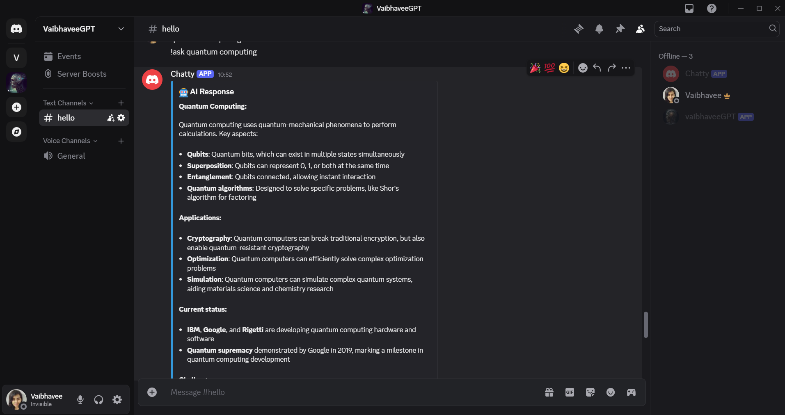

# 🤖 GroqGPT Discord Bot

A powerful and conversational Discord chatbot built using **Python** and the **Groq API**. This bot can answer your questions, chat naturally, and assist in a wide range of topics — all in your Discord server.

## 🚀 Features

- 🔍 Intelligent Q&A
- 💬 Natural conversation flow
- ⚙️ Built using Python & Discord.py
- 🧠 Powered by the Groq LLM API
- 🛡️ Easily extendable and customizable

## 🛠️ Tech Stack

- **Language**: Python 3.10+
- **API**: [Groq API](https://groq.com/)
- **Bot Framework**: [discord.py](https://github.com/Rapptz/discord.py)

## 📸 Screenshots



---

## 🔧 Setup Instructions

### 1. Clone the Repository

```bash
git clone https://github.com/yourusername/groq-discord-bot.git
cd groq-discord-bot
````

### 2. Install Dependencies

We recommend using a virtual environment.

```bash
pip install -r requirements.txt
```

### 3. Add Environment Variables

Create a `.env` file in the root directory and add your keys:

```env
DISCORD_TOKEN=your_discord_bot_token
GROQ_API_KEY=your_groq_api_key
```

### 4. Run the Bot

```bash
python bot.py
```

---

## 🧠 Example Usage

User: `@GroqBot What's the capital of Japan?`
Bot: `The capital of Japan is Tokyo.`

User: `@GroqBot Tell me a joke!`
Bot: `Why don't scientists trust atoms? Because they make up everything!`

---

## 📁 Project Structure

```
groq-discord-bot/
│
├── bot.py               # Main bot logic
├── groq_client.py       # Handles Groq API calls
├── .env                 # Environment variables
├── requirements.txt     # Python dependencies
└── README.md            # Project info
```

---

## 📌 Notes

* This bot supports both prefix-based and mention-based command triggers.
* All responses are generated through Groq’s powerful LLM, offering accurate and fast responses.

---

## 🤝 Contributing

Contributions are welcome!
Please open an issue or PR to improve features or documentation.

---

## 📜 License

MIT License. See `LICENSE` file for more details.

---

## ❤️ Acknowledgments

* [Groq](https://groq.com/)
* [discord.py](https://github.com/Rapptz/discord.py)
* Open-source inspiration from various community projects.


